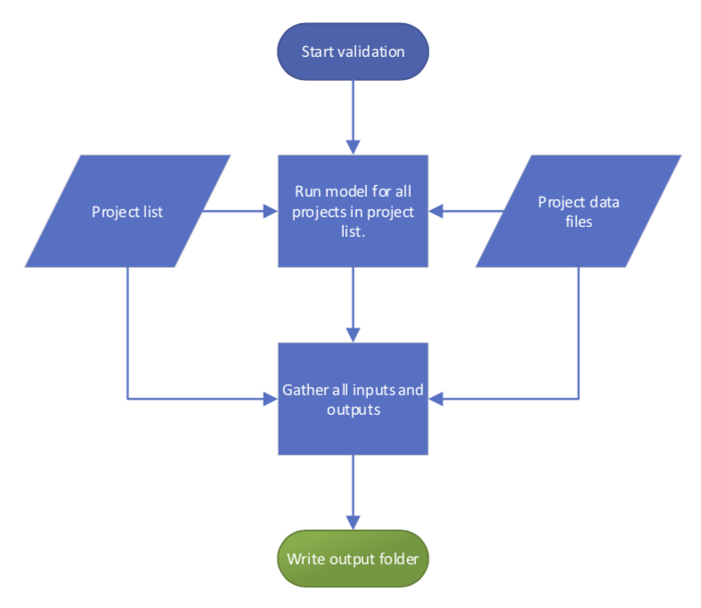
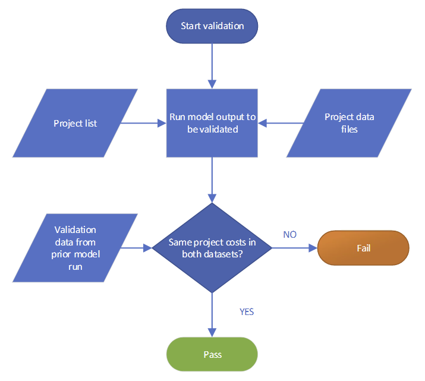

# Input and Output File Structure

LandBOSSE reads multiple files in a folder structure as an input and produces multiple files in a folder structure as an output. To find these files, LandBOSSE looks at its command line or to environment variables for the locations. This document explains how to set up the inputs and outputs.

## Input file structure

The input is comprised of two parts:

+ Project data, which are `.xlsx` spreadsheets that contain sheets of data about components, equipment, crews and so on. There is always at least one, and maybe more, files of project data.

+ A project list which combines parameters that define projects with reference to the project data those projects use. There is only one file that has the project list.

There is a many-to-many correspondence of projects to project data files: multiple projects can reference the same project data.

``` 
|
|--- project_list.xlsx
|---|
    |--- project_data_1.xlsx
    |--- project_data_2.xlsx
    |--- ...
    |--- project_data_N.xlsx
```

There can be other files in the input directory, but LandBOSSE will ignore the extra files if they are not needed.

## Output file structure

The output file structure is comprised of two parts:

+ The actual data output from the model in the form of an `.xlsx` spreadsheet.

+ All the input files that created the output data.

An output folder structure can be reused as an input into LandBOSSE to reproduce results from, or modify inputs into, a particular run of the LandBOSSE model.

When LandBOSSE runs, you give it the path to an output folder. In turn, LandBOSSE puts a timestamped subfolder into the parent folder you specify and places all the output files into that folder. As you run LandBOSSE successive time with the same output folder, you will get an output folder that looks like this:

```
| 
|--- landbosse-YEAR-MONTH-DAY-HOUR-MINUTE-SECOND
|---|
|   |--- landbosse-output.xlsx
|   |--- project_list.xlsx
|   |--- project_data
|      |--- project_data_1.xlsx
|      |--- project_data_2.xlsx
|      |--- etc.
|
|--- landbosse-YEAR-MONTH-DAY-HOUR-MINUTE-SECOND
|---|
    |--- landbosse-output.xlsx
    |--- project_list.xlsx
    |--- project_data
       |--- project_data_1.xlsx
       |--- project_data_2.xlsx
       |--- etc.
```

At the top level are directories timestamped with the date and time the model executed.

## Specifying files during LandBOSSE runs

The easiest way to specify paths to LandBOSSE folders is on the command line, as shown below.

``` 
python main.py --input PATH_TO_INPUT_FOLDER --output PATH_TO_OUTPUT_FOLDER
```

If you prefer shorter command lines, you have the following option:

``` 
python main.py -i PATH_TO_INPUT_FOLDER -o PATH_TO_OUTPUT_FOLDER
```

If you don't want to set the paths every time you execute LandBOSSE, you can set the `LANDBOSSE_INPUT_DIR` and `LANDBOSSE_OUTPUT_DIR` environment variables, but that is not necessary.

Here's a flowchart of how the model gathers and copies input data during normal operation:



## Validating model output

Recall that a LandBOSSE output folder can be used as an input folder. This means that every output folder is a record of inputs, with their associated outputs, that have been created by the LandBOSSE model at a certain point in time. As software development of the model takes place, software defects may be introduced.

The validation process protects against these software defects. The idea is simple: If you take an output folder from a time when you **know that the code operated correctly**, you can attempt to recreate those earlier results with another version of the code. If you can reproduce the results, that means the model is still functioning normally. If you don't reproduce the results, that means the model failed and needs to be fixed.

Here is a flowchart of the validation process:



First, the model runs. However, instead of the final output being written as a file, it is compared to the previously calculated LandBOSSE output. If the outputs compare successfully, the model is working the same as it did at the previous point time when it was verified to be working properly.

The output data previously created and known to be good are known as the **expected** data. Data being validated are called **actual** data. To run a validation, you need three things:

+ Expected output data,
+ Input data that created that expected output data,
+ Actual output data, generated from these input data, to compare against the expected output data.

For validating LandBOSSE, the input data are stored in the same folder structure as you would use for input data for a normal LandBOSSE run, but with an additional file called `landbosse-expected-validation-data.xlsx`, which is the output file generated from a version of LandBOSSE known to operate correctly.

``` 
|
|--- project_list.xlsx
|--- landbosse-expected-validation-data.xlsx
|---|
|   |--- project_data_1.xlsx
|   |--- project_data_2.xlsx
|   |--- ...
|   |--- project_data_N.xlsx
|
|--- landbosse-validation-result.xlsx
```

*Note: The last fie is generated by LandBOSSE during validation. You don't need to supply it ahead of time.*

To validate the model, you would run the following command.

```
python main.py --input PATH_TO_FOLDER_WITH_VALIDATION_DATA --output PATH_TO_YOUR_OUTPUT_FOLDER --validate
```

This command will run the model to obtain the actual data and will create the `landbosse-validation-result.xlsx`. It will write the validation 
